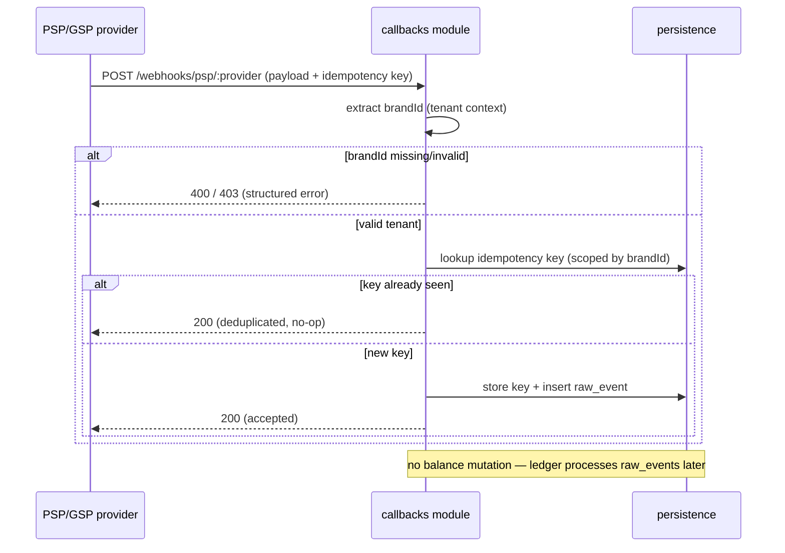

# Architecture

This document describes module boundaries, the data model, and the webhook
lifecycle. For the rules that this design enforces, see the invariants in
[../CLAUDE.md](../CLAUDE.md#hard-invariants-never-violate).

## Module boundaries

The service is split into modules with clear responsibilities. Modules do not
reach into each other's internals; persistence is the only layer that talks to
the database.

| Module | Responsibility | Talks to |
|---|---|---|
| `identity` | Register, login, profile. Issues and validates JWTs. | `persistence` |
| `callbacks` | Receives PSP/GSP webhooks. Validates tenant, deduplicates, stores the raw event. **Never mutates balances.** | `persistence` |
| `persistence` | TypeORM entities and repositories. Applies the `brandId` filter on every query. | database |
| `common` | Cross-cutting concerns: correlation-id middleware, global exception filter, tenant context extraction. | — |

## Data model

Four tables, kept minimal.

| Table | Purpose | Key columns |
|---|---|---|
| `users` | Registered users, scoped to a brand. | `id`, `brandId`, `email`, `passwordHash` |
| `sessions` | Issued JWT sessions (supports revocation). | `id`, `userId`, `token`, `expiresAt` |
| `raw_events` | Raw, unprocessed webhook payloads (outbox-like). | `id`, `brandId`, `provider`, `payload`, `receivedAt` |
| `idempotency_keys` | Keys of already-processed callbacks, for deduplication. | `id`, `brandId`, `key`, `createdAt` |

Notes:
- `raw_events.payload` stores the webhook body verbatim. A later ledger process
  reads from here — the intake path itself does no business processing.
- `idempotency_keys` is scoped by `brandId`, so the same provider key under two
  brands does not collide.

## Tenant isolation

`brandId` represents the tenant (the brand) that owns a row. The rule:

> **INVARIANT:** every read and write in `persistence` is filtered by the current
> request's `brandId`.

This is what guarantees Brand A cannot access Brand B's data, and is covered by a
dedicated tenant-leakage test.

## Webhook lifecycle

When a PSP/GSP callback arrives, the handler validates the tenant, checks for a
duplicate, stores the raw event, and returns `200` — without touching any
balance.

## Request observability

Every incoming request is assigned a correlation/request id by `common`
middleware. The id is included in all log lines for that request, so a single
callback can be traced end to end. See
[../CLAUDE.md](../CLAUDE.md#hard-invariants-never-violate).
